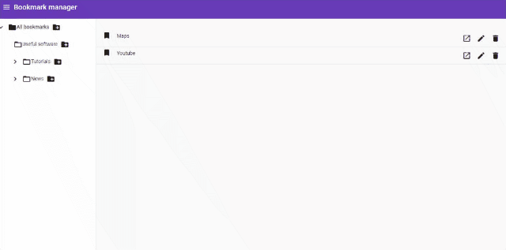
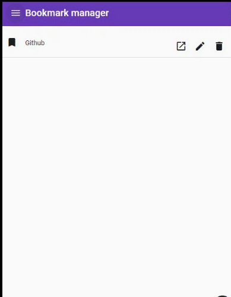
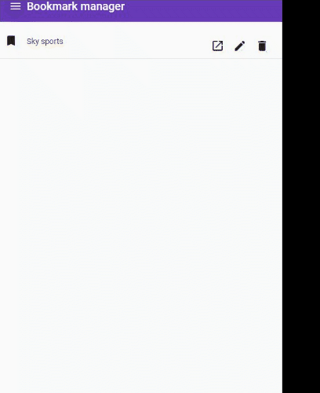
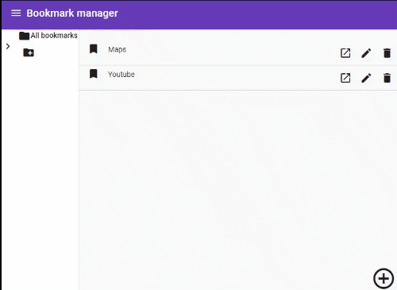

# BookmarkManager

This project was generated with [Angular CLI](https://github.com/angular/angular-cli) version 11.2.0.

## Development server

Run `ng serve` for a dev server. Navigate to `http://localhost:4200/`. The app will automatically reload if you change any of the source files.

### Sample data
To include sample data (predefined bookmarks and groups) in the dev server, run `ng serve -c sample`.

## Code scaffolding

Run `ng generate component component-name` to generate a new component. You can also use `ng generate directive|pipe|service|class|guard|interface|enum|module`.

## Build

Run `ng build` to build the project. The build artifacts will be stored in the `dist/` directory. Use the `--prod` flag for a production build.

## Running unit tests

Run `ng test` to execute the unit tests via [Karma](https://karma-runner.github.io).

## Running end-to-end tests

Run `ng e2e` to execute the end-to-end tests via [Protractor](http://www.protractortest.org/).

## Demo

For the following demo the application is using the default sample data. Some of the implemented features are presented below:

Adding a new bookmark is possible via the cross-button on the bottom right corner.  

From the side navigation, a group can be created by clicking next to an existing group:  

This new group will be placed under the one, on which the group add symbol has been triggered.  

In the next short video, browsing though different categories is displayed in mobile viewport.  

Moreover, you can edit an existing bookmark by clicking on the edit option (pencil) as shown below:  

Last, a user can see the details of a bookmark simply by clicking on it:  

## Further help

To get more help on the Angular CLI use `ng help` or go check out the [Angular CLI Overview and Command Reference](https://angular.io/cli) page.
